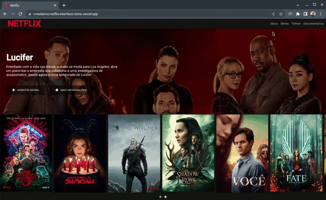

<h1>Boas vindas ao repositório do projeto Interface do Netflix.</h1>

  
Este é um simples projeto desenvolvido no bootcamp <strong>HTML Web Developer</strong> em Outubro de 2021, pela <a href="https://www.dio.me/" target="_blank">Digital Innovation One Inc.</a> A aplicação recria a interface da página do Netflix utilizando de elementos como o Flexbox para construir um layout responsivo.

<h2>Stacks utilizadas</h2>
<ul>
  <li>HTML</li>
  <li>CSS - <i>Flexbox</i>.</li>
  <li>Plugins JQuery</li>
</ul>

<h2>Demonstração da aplicação</h2>

  <a href="https://vmedeiros-netflix-interface-clone.vercel.app/" target="_blank">Link da aplicação</a>

  

